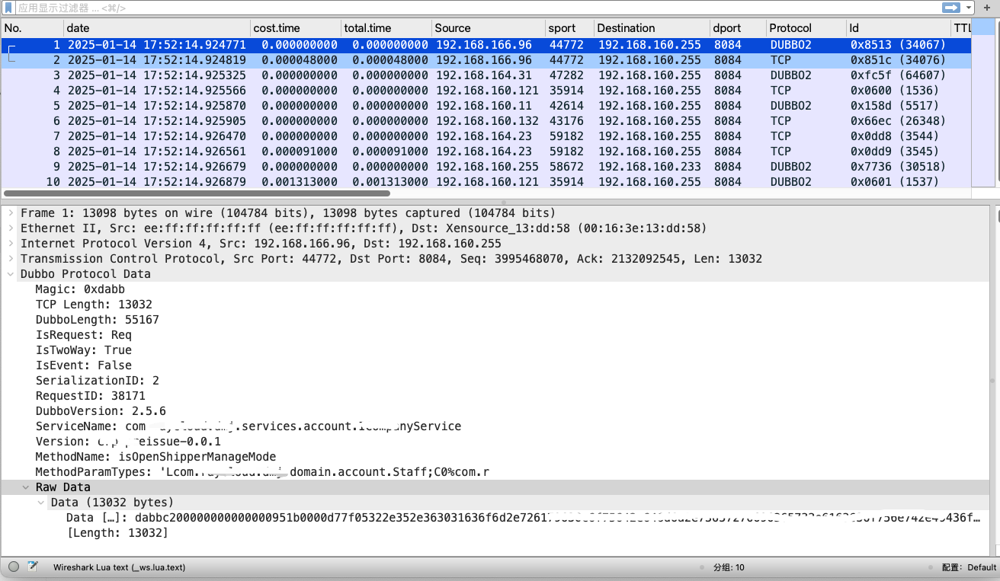
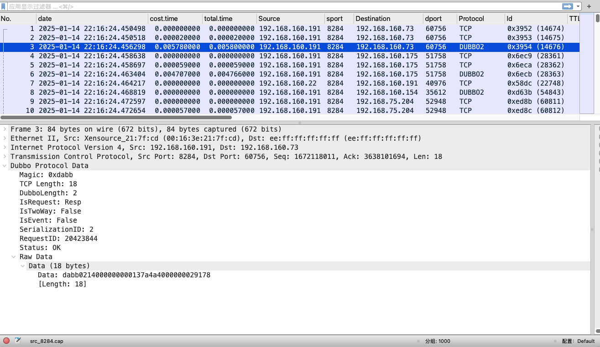

# 介绍
- 解析dubbo流量，支持request、response等部分包拆解
- 通用函数定义

# 使用方法
## 环境准备
- MacOS Sonoma 14.6.1
- Wireshark4.4.3
- Lua 5.3.0
- dubbo数据包
- 打开Wireshark的Lua Console

## 软件设置
- 偏好设置 > 高级 > gui.console_open 修改为ALAWAYS
- 调试技巧多用快捷键Ctrl+Shift+L,注意数据类型和善用print进行调试
- 全局路径: /Applications/Wireshark.app/Contents/Resources/share/wireshark
- 插件路径：/Users/gavin/.local/lib/wireshark/plugins

## 文件说明
- main.lua加载主入口，用来加载需要解析的脚本，比如dubbo.lua。路径地址:/Users/gavin/.local/lib/wireshark/plugins/main.lua
- dubbo.lua解析dubbo协议主文件。路径地址:/Users/gavin/.local/lib/wireshark/etc/dubbo.lua
- base.lua存放一些通用函数，在dubbo.lua进行引用。路径地址:/Users/gavin/.local/lib/wireshark/etc/base.lua
- debug.lua用来输出全局信息，检查环境是否有误。路径地址:/Users/gavin/.local/lib/wireshark/etc/debug.lua

## 效果图如下

